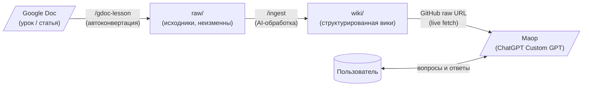
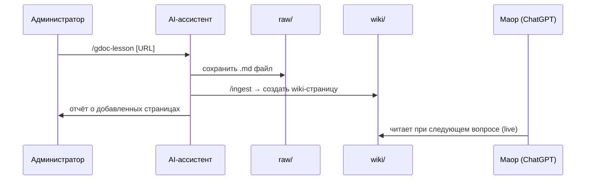

# Kabala-LLM — База знаний по Кабале

Общая база знаний нашей группы по изучению Кабалы.  
Содержит материалы уроков, статьи, понятия — структурированные и связанные между собой.

---

## Для читателей — как задавать вопросы по базе

Используйте **Маор** — специально настроенный помощник в ChatGPT, который читает эту базу и отвечает на вопросы по её содержимому.

> Ссылка на Маор: *(администратор пришлёт вам ссылку)*

Маор работает в обычном браузере, не требует технических знаний, доступен с любого устройства.

---

## Структура репозитория

```
Kabala-LLM/
│
├── raw/                        ← ИСХОДНИКИ (только чтение, никогда не изменять)
│   └── 50-Кабала/
│       ├── *.md                   Конспекты, статьи, заметки
│       ├── Hebrew/                Материалы на иврите
│       └── уроки с Леей/          Уроки с Леей (конспекты + PDF)
│
├── wiki/                       ← ВИКИ (генерируется из raw, можно редактировать)
│   ├── index.md                   Каталог всех страниц
│   ├── overview.md                Обзор всей базы
│   ├── glossary.md                Глоссарий терминов
│   ├── log.md                     Журнал изменений
│   └── concepts/                  Страницы понятий (54 страницы)
│       └── *.md
│
├── doc/                        ← Документация проекта (для администраторов)
│   ├── prompts-to-learn/
│   │   ├── CHATGPT-PROMPT-PLUS.md   Промпт для ChatGPT Plus / Custom GPT
│   │   └── CHATGPT-PROMPT-FREE.md   Промпт для бесплатного ChatGPT
│   ├── CHATGPT-GUIDE.md           Руководство для пользователей
│   ├── REQUIREMENTS.md            Требования к проекту
│   └── ARCHITECTURE.md            Архитектура (будущие фазы)
│
├── tools/
│   └── gdoc-converter/         ← Инструмент конвертации Google Doc → Markdown
│       └── gdoc-to-raw.py         (git submodule)
│
├── CLAUDE.md                   ← Инструкции для AI-ассистента (CLAUDE / Copilot)
└── README.md                   ← Этот файл
```

---

## Как всё работает — общая схема



---

## Для администраторов

### Добавить новый урок из Google Doc

1. Скажите AI-ассистенту (в VS Code / Claude):

   ```
   /gdoc-lesson
   ```

2. Вставьте ссылку на Google Doc, укажите подпапку (например `уроки с Леей`).
3. Скрипт автоматически сконвертирует документ в `.md` и сохранит в `raw/`.
4. После этого автоматически запустится `/ingest` — новая страница появится в `wiki/`.

> **Требование:** файл `tools/gdoc-converter/credentials.json` должен быть  
> скопирован из Google Cloud на вашу машину (однократно, при первой настройке).

---

### Обновить вики вручную (после изменений в raw/)

```
/ingest
```

AI-ассистент найдёт новые/изменённые файлы и создаст/обновит соответствующие страницы в `wiki/`.

---

### Автоматический pipeline в GitHub Actions (Google Doc → raw → ingest → PR)

Добавлен workflow: `.github/workflows/gdoc-ingest-pipeline.yml`.

Он поддерживает:
- `workflow_dispatch` (ручной запуск из GitHub UI);
- `repository_dispatch` с типом `gdoc_ingest` (запуск из внешнего сервиса).

Входные параметры:
- `gdoc_url` (обязательно);
- `subfolder` (по умолчанию: `уроки с Леей`);
- `title` (обязательно) — имя дополнительного raw-файла урока (без `.md`);
- `youtube_url` (обязательно) — ссылка на запись урока;
- `create_pr` (по умолчанию: `true`).

Минимальные Secrets:
- `GDOC_CONVERTER_CREDENTIALS_JSON` — содержимое `credentials.json` для `tools/gdoc-converter`;
- `ANTHROPIC_API_KEY` — ключ для шага ingest-агента;
- `GDOC_CONVERTER_TOKEN_JSON` (опционально) — OAuth token cache `~/.gdoc2md_token.json`.

Pipeline:
1. Берёт ссылку на Google Doc;
2. Запускает существующий `tools/gdoc-converter/gdoc-to-raw.py` (создаёт markdown-конспект в `raw/`);
3. Создаёт дополнительный raw-файл c именем из `title`, который содержит:
   - ссылку на сконвертированный markdown-файл;
   - ссылку на YouTube (`youtube_url`);
4. Запускает ingest-агент (`/ingest`-эквивалент) для обновления `wiki/`;
5. Создаёт PR с изменениями в `raw/` и `wiki/`.

---

### Обновить промпт Маора (Custom GPT)

1. Откройте [doc/prompts-to-learn/CHATGPT-PROMPT-PLUS.md](doc/prompts-to-learn/CHATGPT-PROMPT-PLUS.md)
2. Внесите изменения
3. Скопируйте полный текст файла
4. Зайдите на **chatgpt.com → ваш профиль → My GPTs → Маор → Edit → Configure**
5. Вставьте в поле **Instructions** → Save

---

### Полный цикл добавления материала



---

## Ключевые правила

| Правило | Пояснение |
|---|---|
| `raw/` — только чтение | Никогда не изменять файлы в `raw/` — это первоисточники |
| `wiki/` — генерируется | Страницы создаются AI-ассистентом из `raw/`, но могут редактироваться |
| Обновление live | Маор читает wiki с GitHub при каждом новом вопросе — изменения видны сразу |
| Obsidian совместимость | Вики остаётся валидным Obsidian-хранилищем: `[[wikilinks]]`, граф, теги |

---

## Требования для администраторов

- Git (для клонирования и push)
- VS Code + расширение GitHub Copilot (для `/gdoc-lesson`, `/ingest`)
- Python 3 (для конвертера Google Doc)
- `credentials.json` от Google Cloud (однократная настройка)
- Аккаунт ChatGPT Plus (для обновления Custom GPT Маор)

---

## Ссылки

| Ресурс | Ссылка |
|---|---|
| Репозиторий | https://github.com/AnatFradin/Kabala-LLM |
| Конвертер Google Doc | https://github.com/AnatFradin/convert-google-doc-md |
| Руководство для пользователей | [doc/CHATGPT-GUIDE.md](doc/CHATGPT-GUIDE.md) |
| Требования к проекту | [doc/REQUIREMENTS.md](doc/REQUIREMENTS.md) |
