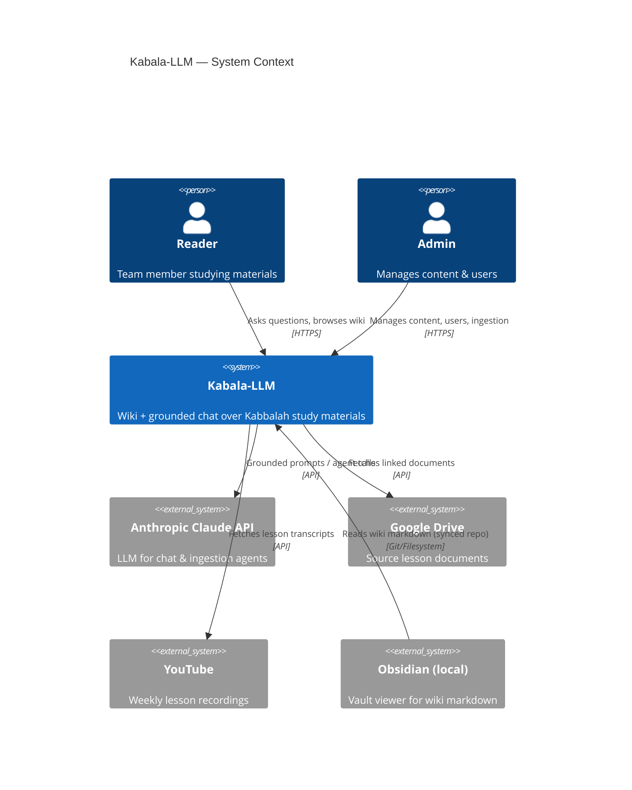
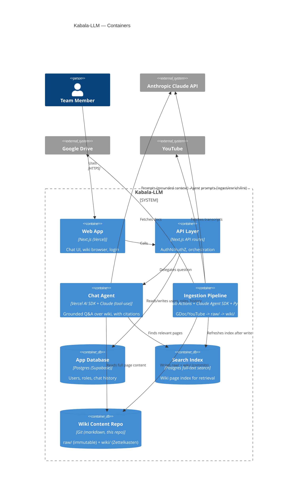
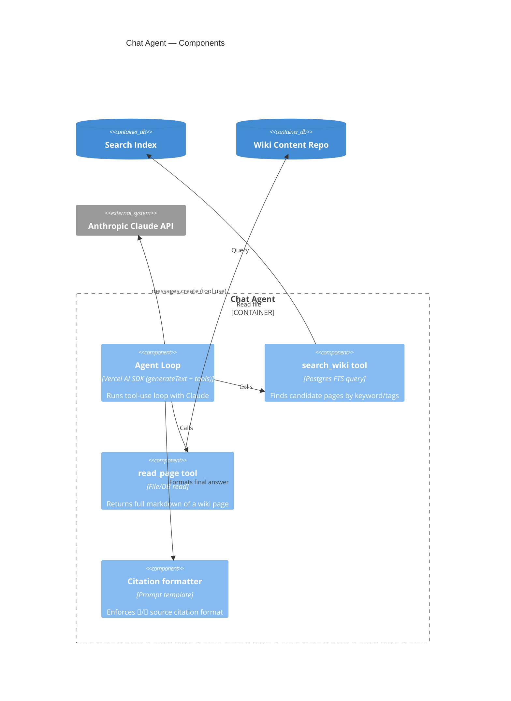
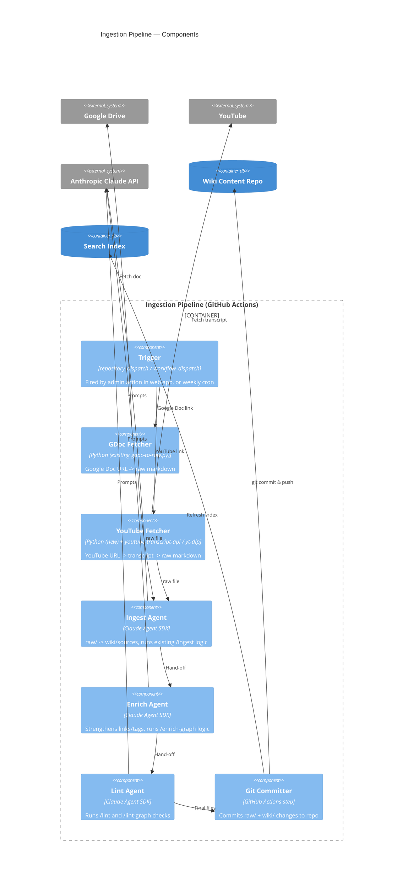

# Kabala-LLM — Architecture (Draft v2)

Status: **DRAFT — hosting & agent framework decisions pending**. Covers system shape
(C4 model), hosting options, and agent/LLM choices for the chat (grounded Q&A) and
ingestion pipeline, per [REQUIREMENTS.md](REQUIREMENTS.md). Principle throughout:
**prefer existing 3rd-party services/tools over building infrastructure ourselves.**

---

## 1. C4 — System Context

---

## 2. C4 — Containers

---

## 3. C4 — Component: Chat Agent (grounded Q&A)

Yes — this should be an **agent** (not a single prompt call), because it needs to:
**search → decide what's relevant → read full page(s) → answer with citations**,
matching the citation rules already defined in your `CLAUDE.md`.

### Chat agent framework options

| Option | What it is | Pros | Cons |
|---|---|---|---|
| **A. Vercel AI SDK** (`ai` npm package, Anthropic provider) — **recommended for Phase 1** | Lightweight tool-calling loop, runs directly in Next.js API routes | Minimal setup, native fit with Vercel hosting, good streaming/UI helpers, easy to add 2 tools (search/read) | Less "agentic" — fine for single/few-hop retrieval, may need upgrade for complex multi-step research |
| **B. Claude Agent SDK** (TypeScript or Python) | Anthropic's own agent runtime — same engine behind Claude Code | Most natural fit since your existing `CLAUDE.md`/skills are already written for this model of operation; powerful for complex multi-step agents | Needs its own long-running process (not ideal on Vercel serverless) — would need a small always-on service (Railway/Fly) |
| **C. LangChain.js / LangGraph** | General-purpose agent orchestration framework | Huge ecosystem, many retrievers/tools pre-built | Heavier dependency, steeper learning curve, overkill for "search 1 index + read pages" |

**Recommendation**: **Option A (Vercel AI SDK)** for Phase 1 — it's a thin layer,
deploys naturally alongside the Next.js app on Vercel, and the "2-tool agent"
(search + read) is simple enough not to need a dedicated agent runtime. If Phase 2+
needs deeper multi-step reasoning (e.g. "compare 5 lessons and summarize"), revisit
**Option B** as a separate service.

---

## 4. C4 — Component: Ingestion Pipeline

### Ingestion pipeline framework options

| Option | What it is | Pros | Cons |
|---|---|---|---|
| **A. GitHub Actions + Claude Agent SDK + Python** — **recommended** | Workflow triggered by `repository_dispatch` (from web app admin action) or cron (weekly lesson); runs Python fetchers + Claude Agent SDK steps reusing your existing `CLAUDE.md`/ingest/enrich/lint prompts; commits results to this git repo | **Zero extra hosting cost** (free minutes for small usage), naturally fits "git repo = source of truth", reuses your existing prompts almost as-is, fully version-controlled/auditable | Cron/dispatch latency (not instant); 6hr job limit (not an issue here) |
| **B. n8n** (open-source workflow automation, self-host or n8n cloud free tier) | Visual workflow tool: webhook → fetch doc/video → call Claude API → write file → git commit | Low-code, easy for non-engineers to see/modify the pipeline visually, large library of integrations (Google Drive, YouTube nodes built-in) | Another service to host/maintain (unless using n8n cloud free tier); less natural fit for "reuse Claude Code prompts" |
| **C. Dedicated worker service** (Railway/Render) running Claude Agent SDK long-lived | Same agent logic as Option A, but as an always-on service with its own queue | Good if ingestion needs to be interactive/real-time (e.g. live progress updates in UI) | Costs ~$5/month minimum; more infra to manage than A |

**Recommendation**: **Option A (GitHub Actions)**. It's free, matches the
git-based wiki model perfectly, and lets us reuse the existing `CLAUDE.md` operating
manual + slash-command prompts (`/ingest`, `/enrich-graph`, `/lint`, `/lint-graph`,
`/gdoc-lesson`) almost unchanged — just run via Claude Agent SDK in CI instead of
interactively. The web app's "submit a link" UI simply triggers a
`repository_dispatch` event; a weekly cron handles the "weekly lesson" YouTube link
automatically.

---

## 5. Hosting Options (≥3, compared)

Constraints: small team, **global access**, **low/symbolic cost**, first-time cloud
deployer, agile MVP-first, needs both a Next.js frontend and (for ingestion) a place
for GitHub Actions to run (free, doesn't need separate hosting).

| | **A. Vercel + Supabase** ⭐ recommended | **B. AWS (Amplify + RDS/Bedrock)** | **C. Railway (all-in-one)** | **D. Render (free tier)** |
|---|---|---|---|---|
| Frontend | Vercel (Next.js native, global edge) | Amplify Hosting | Railway service | Render static/web service |
| Database | Supabase Postgres (free tier) | RDS / Aurora Serverless | Railway Postgres | Render Postgres (free, sleeps) |
| Auth | Supabase Auth (incl. Google OAuth) | Cognito | Auth.js + Railway Postgres | Auth.js + Render Postgres |
| LLM access | Anthropic API directly | Bedrock or Anthropic API | Anthropic API directly | Anthropic API directly |
| Setup complexity | **Low** — guided dashboards, great docs | **High** — IAM, VPC, Cognito, Bedrock access requests | Low–Medium | Low |
| Global latency | Excellent (edge network) | Excellent (many regions) | Good | Good |
| Cost at MVP | **$0/month** | $0 in free tier, risk of surprise charges | ~$5/month flat | $0 (free tier sleeps after inactivity — not ideal for "always on" chat) |
| Fit for ingestion worker | N/A — handled by GitHub Actions (free) | Lambda/Fargate (more setup) | Could host worker if not using GH Actions | Could host worker if not using GH Actions |

**Recommendation**: **Option A — Vercel + Supabase**, with ingestion handled
separately and for free via **GitHub Actions** (Section 4). This avoids needing any
second hosting platform for Phase 1–3, keeps cost at $0, and has by far the lowest
learning curve for a first-time cloud deployer. AWS (B) remains an option later if
the team scales significantly and wants everything under one cloud account — but
isn't worth the setup complexity now.

---

## 6. 3rd-Party Tools Summary

| Need | Tool | Why |
|---|---|---|
| Hosting (web) | Vercel | Native Next.js, free tier, global edge |
| DB + Auth + Storage | Supabase | Free Postgres + Auth (incl. Google OAuth) + file storage in one |
| Chat agent runtime | Vercel AI SDK + Anthropic provider | Lightweight, fits serverless |
| Search/retrieval | Postgres full-text search (built into Supabase) | No vector DB needed, fits "wiki not RAG" requirement |
| Ingestion orchestration | GitHub Actions | Free, git-native, version-controlled |
| Ingestion agents | Claude Agent SDK | Reuses existing `CLAUDE.md`/skill prompts |
| GDoc → markdown | Existing `gdoc-to-raw.py` | Already built, ported into Action |
| YouTube → transcript | `youtube-transcript-api` or `yt-dlp` (+ Whisper/Claude for cleanup) | Standard open-source tools |

---

## 7. Open Items / Next Steps

- [ ] Confirm hosting choice (Vercel + Supabase recommended).
- [ ] Confirm chat agent approach (Vercel AI SDK recommended for Phase 1).
- [ ] Confirm ingestion pipeline approach (GitHub Actions + Claude Agent SDK recommended).
- [ ] Decide auth method: Supabase email/password vs. Google OAuth.
- [ ] Decide where canonical wiki markdown lives (this repo vs. synced from Obsidian vault).
- [ ] Prototype YouTube transcript fetch (test `youtube-transcript-api` against a real lesson recording).

---

Sources for hosting research:
- [Platforms with a real free tier for developers in 2026](https://render.com/articles/platforms-with-a-real-free-tier-for-developers-in-2026)
- [10 Vercel Alternatives for Deploying Apps in 2026 | DigitalOcean](https://www.digitalocean.com/resources/articles/vercel-alternatives)
- [10 Best Next.js Hosting Providers in 2026](https://makerkit.dev/blog/tutorials/best-hosting-nextjs)
- [How to Host a SaaS Application: Vercel vs Railway vs Render (2026)](https://designrevision.com/blog/saas-hosting-compared)
