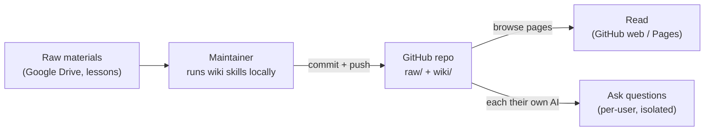

# Phase 0 — "Git-First" Minimal Option (validate before hosting)

Status: **OPTIONAL IDEA** — a cheap, no-hosting first step to test whether the whole
concept (a shared, AI-queryable Kabbalah knowledge base) is actually *useful* to the
team, before building/operating the hosted product in
[ARCHITECTURE.md](ARCHITECTURE.md) / [PLATFORM-COMPARISON.md](PLATFORM-COMPARISON.md).

## Why do this first

- **Near-zero cost, no servers, nothing to operate.** A private GitHub repo is free.
- **Validates the core hypothesis**: does the team actually want to *work with all our
  Kabbalah materials* this way? Better to learn this cheaply than after standing up
  hosting/auth/roles.
- **Loses nothing** — the same `raw/` + `wiki/` repo becomes the source of truth for the
  hosted version later. A stepping stone, not a throwaway.
- **Reversible & incremental** — if useful, we "graduate" to the hosted Docmost portal;
  if not, we've spent almost nothing.

## Team (as of now)

- **11 people, mixed technical ability** — some are comfortable with tools like git /
  Claude Code, some are not.
- **Maintainer(s): 1–2 technical members** curate content and push to GitHub.
- **Readers: everyone** — browse + chat, each using the route that fits their skill
  level (see §D). No single shared chat (avoids the "everyone in one noisy thread"
  problem).

## The idea in one picture

---

## What needs to be done (full checklist)

### A. Repository
- [ ] Create a **private** GitHub repo (free; invite the 11 — Read for readers, Write for
      maintainer(s)). *Private keeps the group's study materials access-controlled.*
- [ ] Lay out the structure (mirrors your existing Obsidian vault):
      `raw/` (immutable), `wiki/` (`index.md`, `log.md`, `overview.md`, glossary,
      `concepts/`, `analyses/`, `sources/`), `CLAUDE.md` (operating manual),
      `README.md`, `.gitignore`, `.claude/commands/` (the skills).
- [ ] `.gitignore`: `.DS_Store`, `.obsidian/workspace*`, OS/temp junk.
- [ ] **Seed content**: copy existing materials into `raw/`; run the wiki skill to
      (re)generate `wiki/`; commit.
- [ ] Write a friendly **README** at the repo root for non-technical readers (what this
      is, how to access, links to the tutorials).
- [ ] Add a short **privacy/usage note** (shared group materials; see Risks).

### B. Content & the maintainer workflow
- [ ] Appoint the maintainer(s) (1–2 technical members).
- [ ] On the maintainer's machine: install Claude Code + the skills; configure
      `gdoc-to-raw.py` (credentials) for Google Doc conversion.
- [ ] Write a 1-page **runbook**: "to add a lesson →
      `/gdoc-lesson` (or drop file in `raw/`) → `/ingest` → `/enrich-graph` → `/lint` →
      review → commit & push."
- [ ] Define the **weekly-lesson cadence** (who adds it, by when).
- [ ] On each update, publish a dated **bundle** — a few **concatenated** markdown files
      by section (merge to ≤20 files to fit ChatGPT limits), so non-technical users can
      re-import in one step.
- [ ] *(For ChatGPT users)* build and maintain **one shared "Kabbalah Wiki GPT"** — a
      Custom GPT loaded with the concatenated bundle + starter prompt, shared by link;
      re-upload the bundle to it on each update (see §D.1). The shared GPT is also the
      **best free-ChatGPT path** (free users can *use* it, just not create it).
- [ ] Also produce a **"lite bundle" (≤3 merged files)** for **free ChatGPT** users, who
      can upload only **3 files/day** into a normal chat.

### C. Reading the wiki (everyone, non-technical friendly)
- [ ] Invite readers to the repo (Read access) — a private GitHub repo is already a
      browsable, access-controlled web view for free. Caveat: Obsidian `[[wikilinks]]`
      are **not clickable** on github.com.
- [ ] *(Recommended)* turn on **GitHub Pages + Quartz** so the same repo also publishes a
      real **web wiki** — graph view, search, clickable links — free, auto-rebuilds on
      push. This is the pleasant "one URL to read everything" for non-technical readers.

### D. Chatting with the data — per-user, no shared noise

> **Why not one shared tool:** a single shared NotebookLM/notebook fails here — capped
> at **~50 sources** (we have far more) and a **single shared chat** (noisy, no per-user
> isolation). So Phase 0 chat is **per-user and isolated**.

> ⚠️ **Key fact — `git pull` only helps *local* tools.** Web chat apps (claude.ai,
> chatgpt.com) do **not** read files on your disk, so `git pull` does nothing for them —
> they refresh via a **GitHub connector** (which syncs from GitHub's servers) or by
> re-uploading. There are three access routes:

**Route A — Local clone + local AI tool** *(technical members; best, free, no file limits)*
- [ ] Clone the repo; chat over the whole `raw/` + `wiki/` with **Claude Code**,
      **Cursor**, or **Obsidian + Smart Connections**. The repo's `CLAUDE.md` makes the
      assistant answer from the wiki *with citations*.
- [ ] **Update = `git pull`.** Provide a one-step **`/pull` (update) skill** — a slash
      command / tiny script that runs `git pull` in the repo so non-CLI users update in
      one click.

**Route B — Cloud app + native GitHub connector** *(no upload, no clone — smoothest for non-technical on a paid plan)*
- [ ] **Claude**: Projects → "+" in Project knowledge → connect the GitHub repo (private
      OK via the GitHub App). Refresh with the **Sync** button. Needs **Pro/Team**.
      *(Auto-sync-on-push is still a roadmap request; today Sync is a manual click — the
      web equivalent of `git pull`.)*
- [ ] **ChatGPT**: connect the repo via the **GitHub connector** (available on
      **Plus/Pro/Team**, not free), or build a **Custom GPT** with the repo as knowledge;
      re-sync manually.
- [ ] Caveat: both connectors were built **code-first** — they work for a document wiki
      but have rough edges; choosing which folders to index helps. Connecting a *private*
      repo means each user authorizes with a GitHub account that has access.

**Route C — Manual bundle upload** *(works on any plan, incl. free — universal fallback)*
- [ ] Maintainer publishes a dated **bundle**; user uploads it to a personal Project/GPT
      and re-uploads to refresh. Most friction, but no GitHub account or paid plan needed.

**Shared across all routes**
- [ ] One standard **"starter prompt"** (from `CLAUDE.md` rules) for everyone: answer only
      from the wiki, **always cite the source page**, handle Russian/Hebrew, say "not in
      the materials" when unknown — so every assistant behaves the same.
- [ ] **Instructions = 3 short guides keyed to route, not brand**: (A) local + `/pull`
      skill, (B) connector — short Claude variant + short ChatGPT variant, (C) manual
      bundle. Default non-technical paid-plan users to **B**, free-tier to **C**,
      technical to **A**.
- [ ] Document **plan/account requirements** per route (ChatGPT connector needs Plus+;
      Claude connector needs Pro/Team; manual bundle works on free).

### D.1 — Which option for which user (cheat-sheet)

| Persona | Best option | How it works | Refresh |
|---|---|---|---|
| **ChatGPT Plus** | **Shared Custom GPT** (maintainer builds once) | Maintainer uploads the bundle into one "Kabbalah Wiki GPT" + starter prompt, shares the link; everyone chats **privately** (no per-user upload, no shared-chat noise) | Maintainer re-uploads to the GPT once; all users get it |
| ChatGPT Plus (alt) | Own Project / GitHub connector | Upload bundle to a personal Project, or connect the repo (Plus supports connectors, but code-oriented/rough for docs) | Re-upload / sync |
| **ChatGPT Free** | Shared **"Kabbalah Wiki GPT"**, or a **lite bundle** | Open the maintainer's shared GPT link (works subject to free message limits; can't *create* GPTs, but can *use* them); or upload a **≤3-file "lite bundle"** into a normal chat (free = **3 files/day**) and ask in that session | Re-open the GPT / re-upload the lite bundle next session |
| **Web-only Claude (Pro)** | **Project + GitHub connector** | In claude.ai (browser — no desktop): Project → "+" → connect repo → ask | Click **Sync** |
| Web-only Claude (Free) | Project + bundle upload | Create Project, upload bundle, paste starter prompt | Re-upload bundle |
| **You / technical (Claude Cowork or Code)** | **Add the local folder** (Route A) | Clone repo, point Cowork/Code at the folder, discuss full `raw/`+`wiki/`; best, no limits | `git pull` / `/pull` skill |

> **Claude Desktop is NOT required** for web users — claude.ai in the browser does
> Projects + the GitHub connector. Desktop / Cowork / Code is only for the *local folder*
> route.

**Recipe — one shared "Kabbalah Wiki GPT" for all ChatGPT users** (lowest friction):
1. Maintainer (Plus) creates a **Custom GPT**.
2. Upload the **concatenated bundle** as knowledge (merge into ≤20 files to fit limits).
3. Paste the standard **starter prompt** as the GPT's instructions.
4. Share the GPT link with the ChatGPT users — they each chat **privately**; no uploads.
5. On updates: maintainer re-uploads the refreshed bundle to the GPT once.

**Caveats baked into the plan:**
- The **bundle must be concatenated** into a handful of merged `.md`/`.txt` files (not
  hundreds) — ChatGPT Custom GPTs cap at ~20 knowledge files + size limits.
- **Free ChatGPT** has **no connectors** and only **3 file uploads/day** — so it needs
  either the shared Custom GPT (no upload) or a **"lite bundle" of ≤3 merged files**.
  Uploads in a normal chat are per-session (re-upload next time).
- The **connector route needs a GitHub account with repo access** per user; the
  **bundle / Custom-GPT route needs no GitHub at all** — the universal lowest common
  denominator.

### E. Tutorials (you offered video — yes)
- [ ] **Video A — non-technical:** create a Claude Project, upload the bundle, paste the
      starter prompt, ask a first question.
- [ ] **Video B — technical:** clone the repo + chat with Claude Code / Cursor / Obsidian
      plugin (and `git pull` to update).
- [ ] **Video C — maintainer:** add one real lesson end-to-end.
- [ ] **1-page written quickstart** for each audience (for people who don't watch videos).

### F. Conventions & governance (light)
- [ ] Keep `raw/` immutable (already a `CLAUDE.md` rule).
- [ ] Keep naming + wikilink conventions (already in `CLAUDE.md`).
- [ ] Maintain `wiki/log.md` as the changelog.
- [ ] Simple **feedback channel** to measure usefulness — a group chat thread or a Google
      Form ("what did you ask? was the answer good? what's missing?").

---

## How people use it day-to-day

- **Non-technical (connector):** read on the Pages site; ask in *your own* Claude/ChatGPT
  with the repo connected — click **Sync** after the maintainer posts an update.
- **Non-technical (bundle):** read on Pages; ask in your Project; re-import the bundle when
  notified.
- **Technical:** `git pull` (or the `/pull` skill); ask via Claude Code / Cursor / Obsidian
  over the full repo.

No shared chat, so no cross-talk between people's conversations.

---

## Pros / Cons / Risks

**Pros**
- ~$0, launch in days, nothing to host or secure.
- **Per-user isolation** by design — no noisy shared chat.
- No file-count ceiling (repo + Projects handle hundreds of files).
- Keeps the git + Obsidian + Zettelkasten vision; repo becomes the future source of truth.

**Cons / Risks**
- **Content freshness**: on update, technical users `git pull` (or the `/pull` skill);
  connector users click **Sync**; bundle users re-import. *Mitigation:* maintainer
  republishes a dated bundle + pings the group on each push. Note: no route auto-updates
  on push yet — refresh is always a manual click/pull.
- **Consistency**: mixed tools (Claude Code / Projects / Obsidian) give slightly
  different experiences. *Mitigation:* standard starter prompt + the shared `CLAUDE.md`
  rules.
- **Privacy/IP**: materials live in each member's personal AI account. Acceptable as
  shared group materials — but state it explicitly.
- **Not the end state**: deliberately not the seamless "one URL, browse + chat, roles"
  product — it's a validation step.

---

## Variations & additional ideas (ranked for our case)

1. ⭐ **Per-user own AI, split by skill** *(recommended default)* — technical: repo +
   Claude Code / Cursor / Obsidian; non-technical: personal Claude Project. Near-zero
   cost, isolated per user, no file ceiling.
2. **Browse-only first (GitHub + Quartz/Pages)** — if you want to first test "is having
   all materials browsable in one place useful?" before adding chat.
3. **One shared Claude Project (Team plan)** — most consistent + smartest model, but it's
   a *shared* chat → same noise problem as NotebookLM, and ~$25/seat. Not ideal for many
   users.
4. **NotebookLM** — ❌ not suitable here: ~50-source cap + single shared-chat noise.
   (Listed so we remember why we ruled it out.)
5. **(Graduation)** Hosted **Docmost** portal — browse + AI + **per-user isolation** +
   roles in one URL. This is what truly solves isolation + many files + non-technical +
   single URL, once Phase 0 proves the idea is worth it.

---

## Exit criteria — when to graduate to the hosted version

Move to the hosted Docmost portal when Phase 0 shows:
- People actually use it (regular questions asked, materials read), **and**
- The friction is the *manual upload/refresh*, *mixed tools*, or *no single seamless
  URL* — i.e. the pain is exactly what hosting solves, not "nobody wants this."

Track lightly: # active users, questions/week, qualitative "was this useful?" feedback.
Low usage → we learned cheaply. High usage → we host with confidence, reusing this very
repo as the source of truth.
