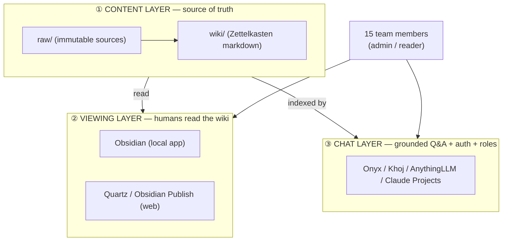

# Kabala-LLM — Platform Comparison (Adopt, Don't Build)

Status: **DECISION SUPPORT** — read this to choose a direction. No code/diagrams yet.

Goal: pick an **existing, production-grade** tool for the chat/UI layer instead of
building one. This doc compares the realistic candidates against *our* requirements
(see [REQUIREMENTS.md](REQUIREMENTS.md)) and explains the content/viewing layers.

---

## 0. The mental model: 3 separable layers

The mistake in earlier drafts was treating this as one app. It's really three layers
that we can mix and match. **You almost never build all three — you adopt each.**

- **Layer ① Content** — your existing git repo + Obsidian vault (`raw/` + `wiki/`),
  produced by your existing Claude Code skills (`/ingest`, `/enrich-graph`, `/lint`).
  **We keep this. It is what makes us a "wiki LLM," not a vector-RAG black box.**
- **Layer ② Viewing** — how people *read/browse* the wiki (this answers your
  "can we use Obsidian?" question — see §1).
- **Layer ③ Chat** — the off-the-shelf tool that indexes Layer ① and gives 15 people
  grounded chat with login + roles. **This is the main decision in this doc (§2).**

The chat tool (③) using vectors *internally* is fine — the human-facing knowledge
stays as browsable markdown in ① and ②. "Not a vector DB" = content isn't *trapped*
in one, which this design guarantees.

---

## 1. Viewing layer — "Can we just use Obsidian?"

**Short answer: Yes for individuals, but not as a shared web app on its own.** Obsidian
is a per-person desktop/mobile app pointed at a local copy of the vault. For 15 people
across countries with browser access + roles, you compose 2–3 of these:

| Option | What it gives | Who it's for | Cost | Roles? |
|---|---|---|---|---|
| **Obsidian (local)** | Full graph, backlinks, editing; the "real" experience | You + power users who sync the git repo | Free | No (local only) |
| **Quartz** (static site) | Renders the vault to a **website** with graph view, backlinks, search; auto-rebuilds on git push | Read-only web wiki for everyone | **Free** (GitHub/Cloudflare Pages) | No (public/static; can password-gate at host level) |
| **Obsidian Publish** | Official hosted web version of the vault | Easiest web wiki, no setup | ~$96/yr | No (public-ish) |
| **The chat tool's doc view** | Onyx/Khoj/AnythingLLM all show the source docs they cite | People already in the chat UI | included | Yes (tool's roles) |

**Recommended viewing setup:** Obsidian (local, free) for editors/power users **+**
Quartz (free) for a browsable web wiki with graph **+** the chosen chat tool's own
document view for in-chat citations. This gives a real "see the content" experience on
the web without paying or building anything.

> Note: true per-user *role-gated* wiki access (admin sees X, reader sees Y) lives in
> the **chat tool** (Layer ③), not in Obsidian/Quartz, which are all-or-nothing
> public/read-only. If role-gated *browsing* matters early, that favors Onyx (§2).

---

## 2. Chat layer — the main decision

All candidates below are open-source/self-hostable (except Claude Projects, which is
SaaS) and can run **Claude as the model**, so "smart agent" is satisfied by all — the
differences are governance, ingestion, fit to the wiki vision, and cost/ops.

### 2.1 Onyx (formerly Danswer)

- **What it is:** Open-source "AI platform" — chat UI + agentic RAG + 40+ data
  connectors, aimed at teams/enterprises. (YC-backed, actively developed.)
- **Hosting:** Docker / Kubernetes / Helm; `docker compose up -d`. Two modes:
  **Lite** (lightweight chat UI, <1 GB RAM) vs **Full** (vector + keyword index +
  background workers that sync connectors). Full stack wants a few GB RAM →
  ~$10–40/mo VPS.
- **Model:** All major providers incl. **Anthropic Claude**; supports **MCP** (Claude's
  tool protocol).
- **Roles / multi-user:** **RBAC + SSO + audit logs**, and **permission-aware RAG**
  (results respect each user's access). These are included in self-hosted.
- **Per-user workspace:** Via assistants + permission scopes (not as literal as
  AnythingLLM's, but governed).
- **Ingestion:** **Native Google Drive connector** with permission sync — directly
  relevant to your "ingest from Google Drive" requirement. Also Slack, Confluence,
  GitHub, web, etc.
- **Wiki fit:** Indexes our git/markdown content; strong at "answer with citations to
  sources." Browsing is doc-centric, not graph-centric.
- **Cost (15 ppl):** ~$10–40/mo VPS + Claude API usage (typically a few $/day max at
  this scale). **No per-seat fee.**
- **Production-readiness:** **Highest** here — SOC 2, governance, connectors.
- **Pros:** Most future-proof; the Google Drive connector + RBAC match our needs;
  agentic; won't be outgrown.
- **Cons:** Heaviest to operate; doc-centric (not Obsidian-graph-native); more concepts
  to learn than Khoj.

### 2.2 Khoj

- **What it is:** Open-source "AI second brain" / research copilot, **markdown- and
  Obsidian-native**. Closest in spirit to your wiki vision.
- **Hosting:** Docker self-host (app + Postgres/pgvector + sandbox + SearxNG). Moderate
  resources → ~$10–20/mo VPS.
- **Model:** **Anthropic Claude** supported (set model-type Anthropic), plus OpenAI/
  Gemini/local.
- **Roles / multi-user:** Multi-user via **Google OAuth or Magic Links**; admin panel
  at `/server/admin`. **Roles are basic** (admin vs user); arbitrary SSO/OAuth2 is a
  requested feature, not yet first-class. Less granular than Onyx.
- **Per-user workspace:** Custom **agents** per user with their own knowledge/tools.
- **Ingestion:** Markdown, PDF, Notion, org-mode, images, **GitHub repos**; **Obsidian
  plugin** auto-syncs a vault. No native Google Drive connector (would script it or
  route via the git repo). Uses **Local Graph RAG (LightRAG)** — graph-aware retrieval,
  philosophically aligned with Zettelkasten.
- **Wiki fit:** **Best of the group** — built around markdown/Obsidian, graph-aware.
- **Cost (15 ppl):** ~$10–20/mo VPS + Claude API. No per-seat fee.
- **Production-readiness:** Medium–high; great for knowledge work, lighter on
  enterprise governance.
- **Pros:** Matches the Obsidian/Zettelkasten vision most closely; lighter; agents,
  automations (e.g. could schedule the weekly-lesson fetch), deep research.
- **Cons:** Weaker fine-grained roles/SSO; no native Google Drive connector; smaller
  ecosystem than Onyx.

### 2.3 AnythingLLM

- **What it is:** Open-source multi-tenant chat + RAG, organized around **workspaces**.
- **Hosting:** Docker (multi-container) or desktop app; can be resource-heavy.
- **Model:** **Anthropic Claude** + many others.
- **Roles / multi-user:** **Simple RBAC** (admin/manager/default) + full multi-tenant.
- **Per-user workspace:** **Its core model** — each workspace is isolated (own
  documents, own vector index). Maps directly to your future "separate workspace per
  login."
- **Ingestion:** File upload, web scraping; vector DBs (LanceDB default, or Pinecone/
  Chroma/Qdrant/etc.). **No native Google Drive connector**; ingestion is more manual
  / scripted.
- **Wiki fit:** Document-centric, not Obsidian-graph-native.
- **Cost (15 ppl):** ~$10–30/mo VPS + Claude API. No per-seat fee.
- **Production-readiness:** Medium; popular, but the most "containers to manage" and
  can be resource-hungry.
- **Pros:** Best if **per-user workspaces + simple admin/reader** is the #1 priority;
  easy multi-tenant mental model.
- **Cons:** No Google Drive connector; not graph/Obsidian-native; heavier ops than Khoj.

### 2.4 Claude Projects (Team plan) — the SaaS / zero-infra option

- **What it is:** Anthropic's own product. Team plan = shared **Project folders** +
  each user's **own projects**; admin console; 200k context.
- **Hosting:** **None — fully managed.** Nothing to deploy or maintain.
- **Model:** **Claude, natively — the smartest option, zero integration work.**
- **Roles / multi-user:** Basic admin console; not granular RBAC.
- **Per-user workspace:** Yes — each user creates their own projects naturally.
- **Ingestion:** **Manual upload** of files into project knowledge (no Google Drive /
  git auto-sync, no automated pipeline). Re-uploading on every wiki change is the pain.
- **Wiki fit:** **Weakest** — no browsable wiki, no Obsidian graph, content lives
  inside Claude, not as our git markdown.
- **Cost (15 ppl):** **~$375/mo** ($25/seat × 15, min 5 seats). Not "symbolic."
- **Production-readiness:** High (it's a polished SaaS), but not shaped like a wiki.
- **Pros:** Zero ops, smartest model, fastest to "try it today."
- **Cons:** Pricey at 15; no automated ingestion; breaks the "browsable git/Obsidian
  wiki" vision; content not portable.

### 2.5 LibreChat — mentioned for completeness

Polished multi-provider chat with an agent builder and RAG, but **lacks fine-grained
roles** (all users see the same models/tools) and isn't wiki/Obsidian-shaped. Good as a
generic chat front-end; **not recommended** here because governance + wiki fit are core
to our requirements.

---

## 3. Scorecard against our requirements

Weighted to what you've stated matters: production/future-proof, smart model, roles,
per-user workspaces, Obsidian/wiki fit, Google Drive ingestion, low cost, low ops.

| Requirement                       | Onyx         | Khoj         | AnythingLLM  | Claude Projects |
| --------------------------------- | ------------ | ------------ | ------------ | --------------- |
| Don't build a new app             | ✅            | ✅            | ✅            | ✅✅              |
| Smart / production model (Claude) | ✅            | ✅            | ✅            | ✅✅              |
| Admin/reader roles                | ✅✅           | ⚠️ basic     | ✅            | ⚠️ basic        |
| Per-user workspaces (future)      | ✅            | ✅            | ✅✅           | ✅               |
| Obsidian / Zettelkasten fit       | ⚠️           | ✅✅           | ⚠️           | ❌               |
| Google Drive ingestion            | ✅✅ native    | ⚠️ script    | ⚠️ script    | ❌ manual        |
| Permission-gated browsing         | ✅✅           | ⚠️           | ✅            | ⚠️              |
| Low/symbolic cost @15             | ✅ ~$10–40/mo | ✅ ~$10–20/mo | ✅ ~$10–30/mo | ❌ ~$375/mo      |
| Low ops / easy to run             | ⚠️ heaviest  | ✅            | ⚠️           | ✅✅ none         |
| Agentic depth                     | ✅✅           | ✅            | ✅            | ✅✅              |

Legend: ✅✅ excellent · ✅ good · ⚠️ partial/with effort · ❌ poor

---

## 4. Content layer — the second open question

Where does the canonical knowledge live? Two options:

**4A. Git + Obsidian vault is the source of truth** *(recommended)*
- We keep `raw/` + `wiki/`; existing Claude Code skills generate the wiki; the chat
  tool just **indexes** that repo.
- ✅ Fully matches the "wiki LLM" vision; content is portable, version-controlled,
  Obsidian/Quartz-viewable; we reuse your existing pipeline; not locked to any vendor.
- ⚠️ Ingestion automation = run the skills (locally or via GitHub Actions) + point the
  tool at the repo. One extra moving part.

**4B. The tool owns the content** (e.g. Onyx connectors pull Google Drive directly)
- The adopted tool ingests sources directly; less of "our own wiki," more "their index."
- ✅ More automatic (esp. Onyx's Google Drive connector); fewer pieces.
- ❌ Weakens the browsable-Obsidian-wiki vision; content portability depends on the tool;
  Zettelkasten linking is lost unless we keep generating the wiki anyway.

**Recommendation:** **4A** — keep the git/Obsidian vault as truth (that's the whole
point of "wiki LLM"), and let the chat tool index it. Onyx can *additionally* use its
Google Drive connector to **fetch new raw sources** into the pipeline, getting us the
best of both: automated intake + a real, portable, browsable wiki.

---

## 5. Recommendation & how to choose

There's no single winner — it depends on which axis you weight hardest:

- **If "production-grade, governed, auto-ingest from Google Drive, won't outgrow it" is
  #1 → Onyx.** Best long-term platform; the Google Drive connector + RBAC directly
  serve your stated needs. Cost: a small VPS, no per-seat fees.
- **If "stay true to Obsidian/Zettelkasten + keep it simple" is #1 → Khoj.** Closest to
  the wiki vision, lighter to run; trade some governance.
- **If "isolated per-user workspaces + dead-simple roles" is #1 → AnythingLLM.**
- **If "zero ops, try it this week, money no object" is #1 → Claude Projects** — but
  ~$375/mo and it abandons the browsable-wiki vision, so likely not our pick.

**My lean:** **Onyx for the chat layer + Option 4A (git/Obsidian as source of truth)
for the content layer + Obsidian/Quartz for viewing.** It satisfies the most hard requirements at low recurring cost and is the
most future-proof. **Khoj is the strong runner-up** if you'd rather optimize for
Obsidian-fidelity and simplicity over enterprise governance.

### To discuss / decide next
1. Which axis above matters most to you (governance vs Obsidian-fidelity vs per-user
   workspaces vs zero-ops)? That picks the tool.
2. Content layer: confirm 4A (git/Obsidian as truth) vs 4B (tool-owned).
3. Viewing: is a free **Quartz** web wiki enough, or do you want role-gated browsing
   (which pushes us toward Onyx)?

Once these three are answered, I'll write a clean architecture doc with **properly
laid-out, explained diagrams** for the chosen stack — not before.

---

## Sources
- [Onyx GitHub](https://github.com/onyx-dot-app/onyx) · [Onyx deployment docs](https://docs.onyx.app/deployment/overview)
- [Khoj GitHub](https://github.com/khoj-ai/khoj) · [Khoj self-host](https://docs.khoj.dev/get-started/setup/) · [Khoj multi-user auth](https://docs.khoj.dev/advanced/authentication/) · [Khoj Obsidian client](https://docs.khoj.dev/clients/obsidian/)
- [Open WebUI vs AnythingLLM vs LibreChat (2026)](https://toolhalla.ai/blog/open-webui-vs-anythingllm-vs-librechat-2026) · [AnythingLLM vs Open WebUI vs LibreChat (2026)](https://runaihome.com/blog/anythingllm-vs-open-webui-vs-librechat-2026/)
- [OpenWebUI vs LibreChat vs Onyx (2026)](https://onyx.app/insights/openwebui-vs-librechat-vs-onyx)
- [Quartz — publish Obsidian vault](https://www.ssp.sh/brain/quartz-publish-obsidian-vault/) · [Obsidian Publish alternatives (2026)](https://unmarkdown.com/blog/obsidian-publish-alternatives)
- [Claude pricing 2026 (Team plan)](https://www.nocode.mba/articles/claude-pricing-2026)
